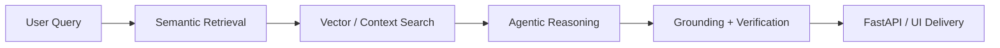
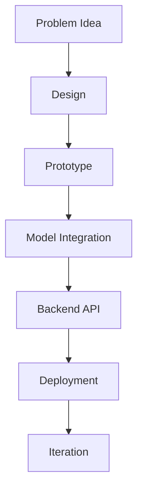

<!-- ============================================================ -->

<!--                 ULTIMATE CYBERPUNK GITHUB README            -->

<!-- ============================================================ -->

<div align="center">


<br/>


</div>

---

<div align="center">
  
</div>

---

#  NEURAL DOSSIER

<div align="center">
  
</div>

```bash
> whoami
Suprovo Mallick

> class
AI / ML Developer

> specialization
GenAI systems • RAG pipelines • agentic workflows • ML deployment

> mission
Build useful, deployable, and visually cool AI systems instead of dead notebook demos.

> current_focus
- retrieval engineering
- grounded generation
- runtime verification
- FastAPI + LLM backends
- scalable AI product workflows

> location
West Bengal, India
```

<br clear="right"/>

---

#  SIGNAL BOARD

<div align="center">

| Signal               | Value                                  |
| -------------------- | -------------------------------------- |
| 🎓 Education         | B.Tech CSE, KIIT (2023–2027)           |
| 💼 Current Direction | GenAI apps, RAG, agents, production AI |
| ⚡ Strength           | Turning ideas into deployable systems  |
| 🧠 Problem Solving   | 280+ DSA problems solved               |
| 🏅 Recognition       | HackerRank 5-Star Python               |
| 🎯 Vibe              | Hacker energy + AI builder mindset     |

</div>

---

#  FEATURED SYSTEMS

<div align="center">

<table>
<tr>
<td width="50%" valign="top">

## 🌾 Wheat Guardian

```yaml
system: AI wheat disease detection
stack: [TensorFlow, EfficientNetV2, FastAPI, Docker]
accuracy: 93%+
status: deployed
```

* Multi-class wheat disease classification
* End-to-end inference pipeline
* Deployable API + container workflow

**LIVE NODE:** [https://wheat-analysis-app.vercel.app](https://wheat-analysis-app.vercel.app)

</td>
<td width="50%" valign="top">

## 🥗 Aahar

```yaml
system: AI diet + wellness companion
stack: [LangChain, Gemini API, ChromaDB, FastAPI]
type: RAG assistant
status: live
```

* Context-aware nutrition guidance
* Calorie estimation + wellness assistance
* Retrieval-backed conversation flow

**LIVE NODE:** [https://aahar-react.vercel.app](https://aahar-react.vercel.app)

</td>
</tr>
<tr>
<td width="50%" valign="top">

## 🧠 Intent Compiler

```yaml
system: multi-agent architecture generator
stack: [LangGraph, Groq LLaMA, Streamlit]
mode: orchestration
status: deployed
```

* Product idea → structured architecture
* Generates schema, requirements, pseudo-code
* Agentic planning workflow

**LIVE NODE:** [https://intent-compiler-bydyno.streamlit.app](https://intent-compiler-bydyno.streamlit.app)
**SOURCE:** [https://github.com/DYNOSuprovo/intent-compiler](https://github.com/DYNOSuprovo/intent-compiler)

</td>
<td width="50%" valign="top">

## 🌍 Translate-V2

```yaml
system: multilingual translation engine
stack: [Transformers, PyTorch, FastAPI]
model: NLLB-200
latency_gain: 38%
```

* Low-resource language translation
* Optimized inference batching
* Hugging Face deployment

**LIVE NODE:** [https://huggingface.co/spaces/Dyno1307/Translate-V2](https://huggingface.co/spaces/Dyno1307/Translate-V2)

</td>
</tr>
</table>

</div>

---

#  PROJECT MATRIX

<div align="center">
  <a href="https://github.com/DYNOSuprovo/intent-compiler">
    
  </a>
</div>

<div align="center">

```diff
+ Add dedicated public repos for Wheat Guardian, Aahar, and Pluto
+ Then this section can become a full 4-card showcase grid
```

</div>

---

#  AI SYSTEM MAP

<div align="center">



</div>

<div align="center">



</div>

---

#  WEAPON STACK

<div align="center">

### Languages


### AI / ML


### GenAI / RAG


### Backend / Tools / Deployment


</div>

---

#  POWER LEVELS

<div align="center">


</div>

---

#  GITHUB ANALYTICS CORE

<div align="center">
  
  
</div>

<div align="center">
  
  
</div>

<div align="center">
  
</div>

---

#  METRICS EXPANSION

<div align="center">
  
  
</div>

<div align="center">
  
  
</div>

---

#  CONTRIBUTION MATRIX

<div align="center">
  
</div>

---

#  LIVE ANIMATIONS

<div align="center">
  
</div>

<div align="center">
  
</div>

---

#  CYBER LAB

<div align="center">

```diff
+ Experimenting with retrieval optimization
+ Building RAG-backed assistants
+ Designing agentic system flows
+ Improving grounding and verification
+ Shipping AI through APIs and frontends
```

</div>

<div align="center">

```yaml
lab_focus:
  - semantic retrieval
  - vector search
  - LLM orchestration
  - FastAPI deployment
  - inference optimization
  - production-minded AI systems
```

</div>

---

#  DEV PERSONALITY PATCH

<div align="center">

```ini
[system_profile]
alias = DYNO
mode = cyberpunk_ai_builder
favorite_stack = Python + FastAPI + GenAI
energy_source = curiosity + problem solving + cool demos
preferred_output = systems_that_actually_work
```

</div>

---

#  SIDE CHANNELS

<div align="center">
  
</div>

<div align="center">
  
</div>

<div align="center">
  
</div>

<div align="center">
  
</div>

---

#  NETWORK LINKS

<div align="center">
<a href="mailto:supromallick3@gmail.com"></a>
<a href="https://www.linkedin.com/in/suprovo-mallick-abb582287/"></a>
<a href="https://github.com/DYNOSuprovo"></a>
<a href="https://huggingface.co/Dyno1307"></a>
<a href="https://leetcode.com/u/supromallick3/"></a>
<a href="https://www.hackerrank.com/profile/supromallick3"></a>
<a href="https://dyno-suprovo-github-io.vercel.app/"></a>
</div>

---

#  FINAL TRANSMISSION

<div align="center">

```diff
+ I don't build dead demos.
+ I build AI systems with movement.
+ I build pipelines that deploy.
+ I build products that feel alive.
+ I build cool things because boring is illegal.
```

</div>

<div align="center">
  
</div>
