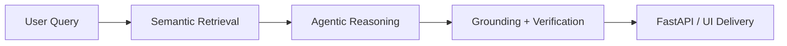

<!-- =============================================== -->

<!--      CYBERPUNK / HACKER STYLE GITHUB README     -->

<!-- =============================================== -->

<div align="center">


<br/>


</div>

---

<div align="center">
  
</div>

---

#  NEURAL DOSSIER

<div align="center">

</div>

```bash
> whoami
Suprovo Mallick

> role
AI / ML Developer | GenAI Builder | FastAPI + LLM Systems Engineer

> mission
Build flashy, useful, production-ready AI systems instead of dead notebook demos.

> interests
RAG pipelines
AI agents
verification guardrails
retrieval engineering
ML deployment

> location
West Bengal, India
```

<br clear="right"/>

---

#  FEATURED SYSTEMS

<div align="center">

<table>
<tr>
<td width="50%" valign="top">

## 🌾 Wheat Guardian

```yaml
system: AI wheat disease detection
stack: [TensorFlow, EfficientNetV2, FastAPI, Docker]
accuracy: 93%+
status: deployed
```

* High-accuracy disease classification
* End-to-end inference API pipeline
* Containerized for deployment

**LIVE NODE:** [https://wheat-analysis-app.vercel.app](https://wheat-analysis-app.vercel.app)

</td>
<td width="50%" valign="top">

## 🥗 Aahar

```yaml
system: AI diet + wellness companion
stack: [LangChain, Gemini API, ChromaDB, FastAPI]
type: RAG assistant
status: live
```

* Context-aware nutrition guidance
* Calorie estimation + wellness recommendations
* Retrieval-backed assistant flow

**LIVE NODE:** [https://aahar-react.vercel.app](https://aahar-react.vercel.app)

</td>
</tr>
<tr>
<td width="50%" valign="top">

## 🧠 Intent Compiler

```yaml
system: multi-agent architecture generator
stack: [LangGraph, Groq LLaMA, Streamlit]
mode: orchestration
status: deployed
```

* Converts product ideas into architecture plans
* Generates schema, requirements, pseudo-code
* Agentic workflow generation

**LIVE NODE:** [https://intent-compiler-bydyno.streamlit.app](https://intent-compiler-bydyno.streamlit.app)
**SOURCE:** [https://github.com/DYNOSuprovo/intent-compiler](https://github.com/DYNOSuprovo/intent-compiler)

</td>
<td width="50%" valign="top">

## 🌍 Translate-V2

```yaml
system: multilingual translation engine
stack: [Transformers, PyTorch, FastAPI]
model: NLLB-200
latency_gain: 38%
```

* Translation for low-resource languages
* Optimized inference batching
* Hugging Face deployment

**LIVE NODE:** [https://huggingface.co/spaces/Dyno1307/Translate-V2](https://huggingface.co/spaces/Dyno1307/Translate-V2)

</td>
</tr>
</table>

</div>

---

#  SYSTEM MAP

<div align="center">



</div>

<div align="center">

</div>

---

#  WEAPON STACK

<div align="center">


</div>

---

#  POWER LEVELS

<div align="center">

<table>
<tr>
<td align="center"></td>
<td align="center"></td>
<td align="center"></td>
</tr>
<tr>
<td align="center"></td>
<td align="center"></td>
<td align="center"></td>
</tr>
</table>

</div>

---

#  GITHUB ANALYTICS

<div align="center">
  
  
</div>

<div align="center">
  
  
</div>

<div align="center">
  
</div>

---

#  LIVE ANIMATIONS

<div align="center">
  
</div>

<div align="center">
  
</div>

---

#  PROJECT CARDS

<div align="center">
  <a href="https://github.com/DYNOSuprovo/intent-compiler">
    
  </a>
</div>

> Add more repo cards here once you have dedicated public repos for Wheat Guardian, Aahar, or Pluto.

---

#  SIDE CHANNELS

<div align="center">
  
</div>

<div align="center">
  
</div>

<div align="center">
  
</div>

> Spotify widget works only if you deploy/configure your own Novatorem endpoint.

---

#  NETWORK LINKS

<div align="center">
<a href="mailto:supromallick3@gmail.com"></a>
<a href="https://www.linkedin.com/in/suprovo-mallick-abb582287/"></a>
<a href="https://github.com/DYNOSuprovo"></a>
<a href="https://huggingface.co/Dyno1307"></a>
<a href="https://leetcode.com/u/supromallick3/"></a>
<a href="https://www.hackerrank.com/profile/supromallick3"></a>
<a href="https://dyno-suprovo-github-io.vercel.app/"></a>
</div>

---

<div align="center">

```diff
+ I don't just build AI demos.
+ I build systems that deploy.
+ I build systems that work.
+ I build systems that look cool doing it.
```

</div>

<div align="center">

</div>
