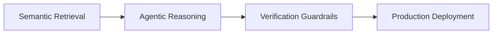

<!-- =============================================== -->

<!--              ELITE GITHUB PROFILE README        -->

<!-- =============================================== -->

 
 

---

  

---

# ✨ About Me

* 🎓 Computer Science undergraduate at **KIIT**
* 🤖 Building **Generative AI systems** with RAG, agents, and scalable backends
* 🧠 Interested in **runtime verification, grounded generation, and production AI pipelines**
* ⚡ I like building **deployable AI products**, not just notebooks
* 🌱 Currently learning deeper **system design for GenAI** and **high-fidelity retrieval systems**
* 🎯 Targeting impactful work in **AI engineering, ML systems, and open source**

 

---

# 🚀 Featured Projects

<table>
<tr>
<td width="50%" valign="top">

## 🌾 Wheat Guardian

**AI-powered wheat disease detection system**

**Stack:** TensorFlow • EfficientNetV2 • FastAPI • Docker

* Achieved **93%+ accuracy** on multi-class disease classification
* Built end-to-end inference pipeline with deployable APIs
* Containerized model serving workflow

🔗 **Live:** [https://wheat-analysis-app.vercel.app](https://wheat-analysis-app.vercel.app)

</td>
<td width="50%" valign="top">

## 🥗 Aahar

**AI Diet & Wellness Companion**

**Stack:** LangChain • Gemini API • ChromaDB • FastAPI

* Built a **RAG-based nutrition assistant**
* Added calorie estimation and wellness support
* Focused on practical diet guidance and retrieval quality

🔗 **Live:** [https://aahar-react.vercel.app](https://aahar-react.vercel.app)

</td>
</tr>
<tr>
<td width="50%" valign="top">

## 🧠 Intent Compiler

**Multi-agent AI architecture generator**

**Stack:** LangGraph • Groq LLaMA • Streamlit

* Converts product ideas into structured architecture
* Generates requirements, schema, and pseudo-code
* Uses agent orchestration for workflow planning

🔗 **Live:** [https://intent-compiler-bydyno.streamlit.app](https://intent-compiler-bydyno.streamlit.app)
🔗 **Repo:** [https://github.com/DYNOSuprovo/intent-compiler](https://github.com/DYNOSuprovo/intent-compiler)

</td>
<td width="50%" valign="top">

## 🌍 Translate-V2

**Neural machine translation system**

**Stack:** Transformers • PyTorch • FastAPI

* Built multilingual translation using **NLLB-200**
* Reduced inference latency by **38%**
* Deployed on Hugging Face Spaces

🔗 **Demo:** [https://huggingface.co/spaces/Dyno1307/Translate-V2](https://huggingface.co/spaces/Dyno1307/Translate-V2)

</td>
</tr>
</table>

---

# 🧪 Current Focus

* Multi-agent and verification-first **RAG pipelines**
* FastAPI backends for **LLM applications**
* Better **retrieval, grounding, and inference optimization**
* AI products that are **traceable, useful, and scalable**

---

# 🛠️ Tech Arsenal

### Languages

### AI / ML

### GenAI / RAG

### Backend / Deployment / Tools

---

# 🏆 Highlights

| Achievement        | Details                                              |
| ------------------ | ---------------------------------------------------- |
| 💼 Experience      | **AI Chatbot & GenAI Developer** at Fed Society      |
| ⚡ Optimization     | Improved chatbot speed by **30%**                    |
| 🧠 Problem Solving | Solved **280+ DSA problems**                         |
| 🏅 Badge           | HackerRank **5-Star Python Badge**                   |
| 🔬 Direction       | Focused on **RAG, agents, verification, ML systems** |

---

# 📊 GitHub Analytics

  
  

  
  

  

---

# 📈 Contribution Activity

  

---

# 🐍 Contribution Snake

  

---

# 🎵 Spotify / Now Playing

  

> Replace the Spotify widget above only if you set up a working Novatorem deployment.

---

# 😂 Dev Corner

  

  

---

# 🌐 Connect With Me

---

# 👀 Profile Visitor 3D Style Add-on

  

---

### ⭐ *"I build AI systems that are not just intelligent, but useful, grounded, and deployable."*

